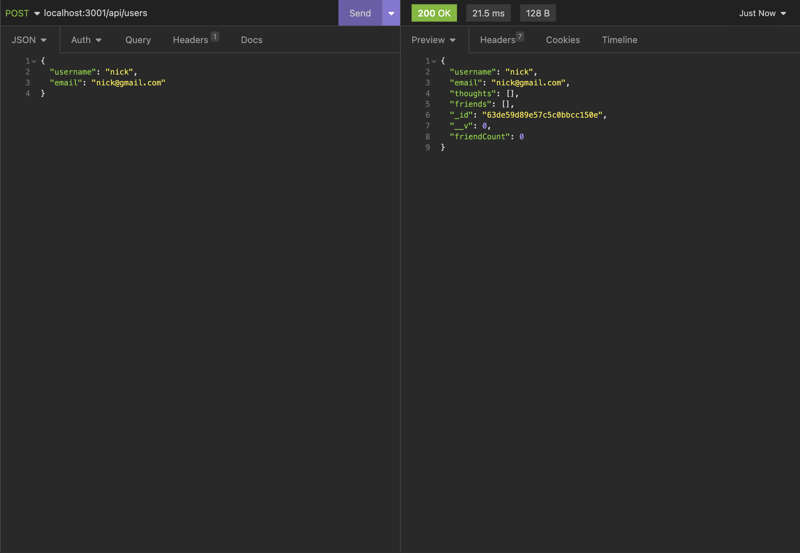
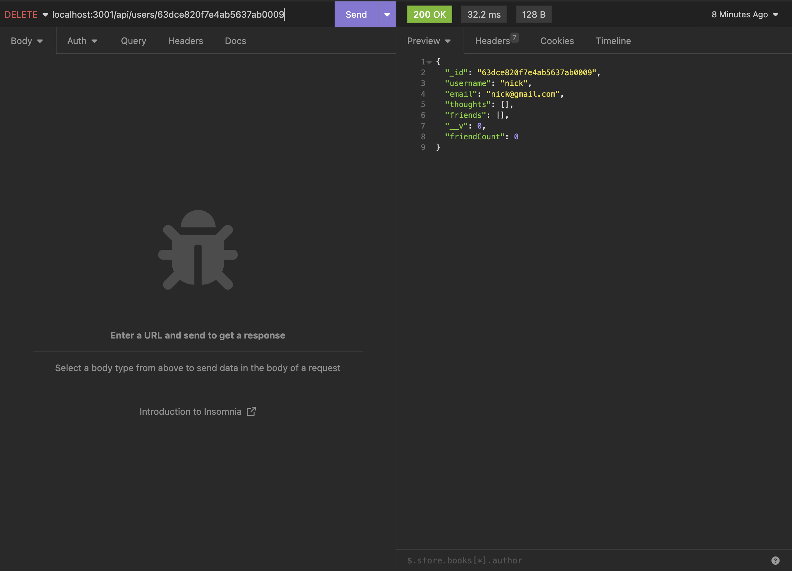
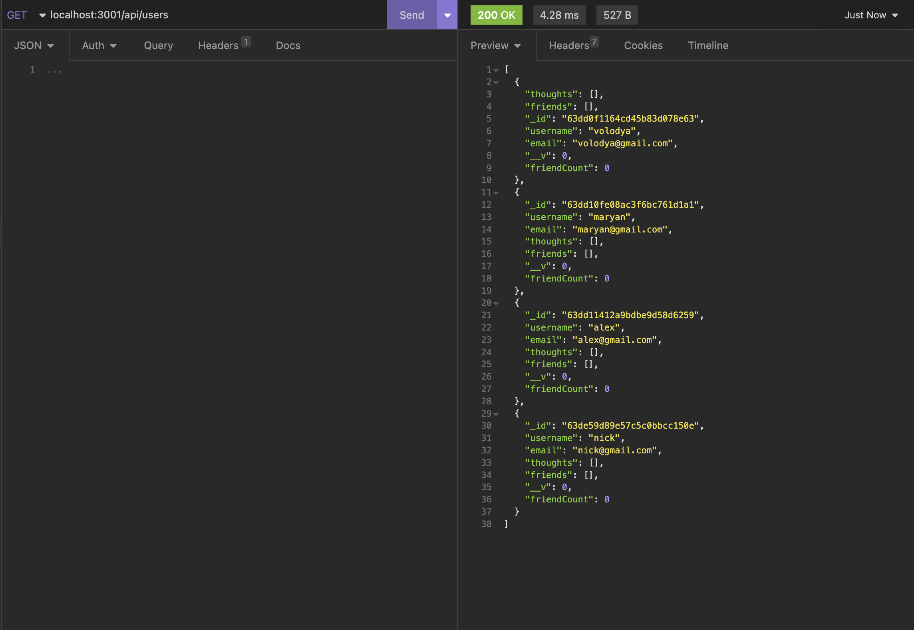
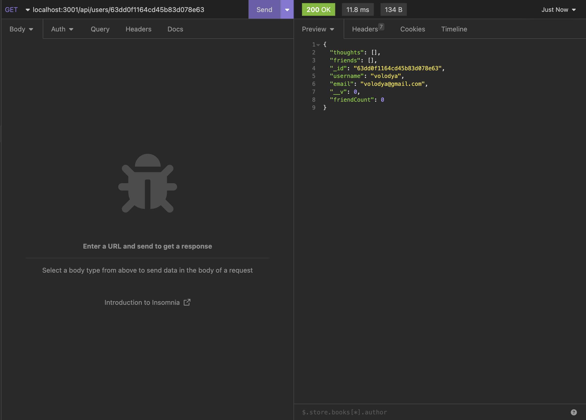
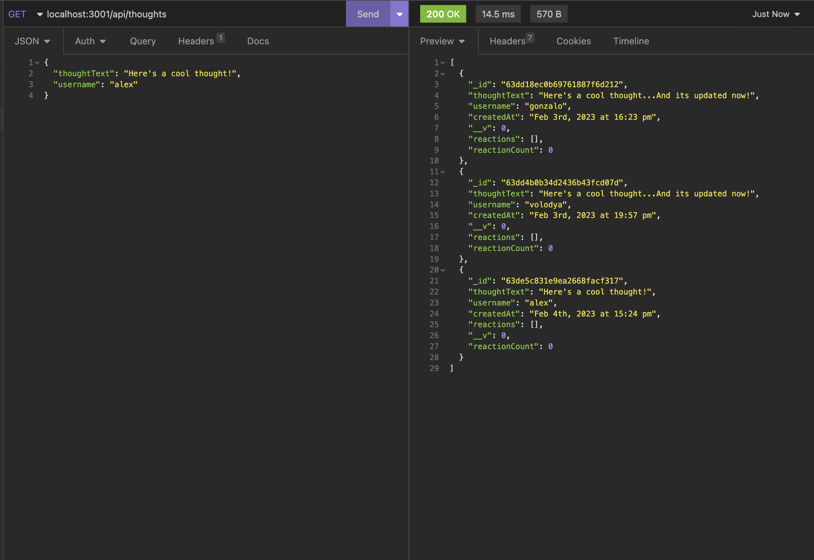
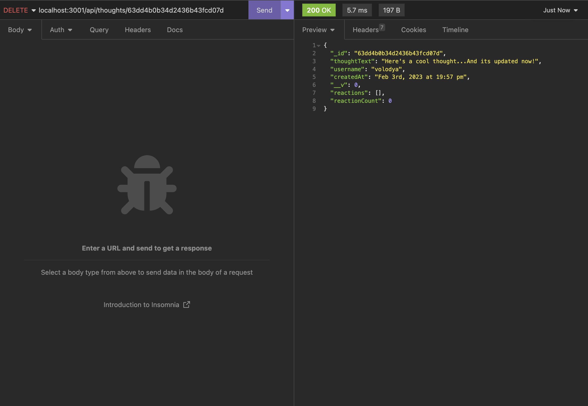

# Social Network API
  ## License: MIT
  ### 
  ## Table of Contents
  - [Description](#description)
  - [Screenshots of Application](#screenshots-of-application)
  - [Github Link](#github-link)

  ## Description:
  This project is an API for a social network using Express.js for routing, a MongoDB database, and the Mongoose ODM.
  
  ## Screenshots of Application

  Create User

  

  Delete User

  

  Get All Users

  

  Get User by ID

  

  Create Tought

  

  Delete Tought

  

  ## GitHub Link
  - https://github.com/Havrushchenko/social-network-api

  This README.md is made with a [Proffesional Readme Generator](https://github.com/Havrushchenko/proffesional-readme-generator).